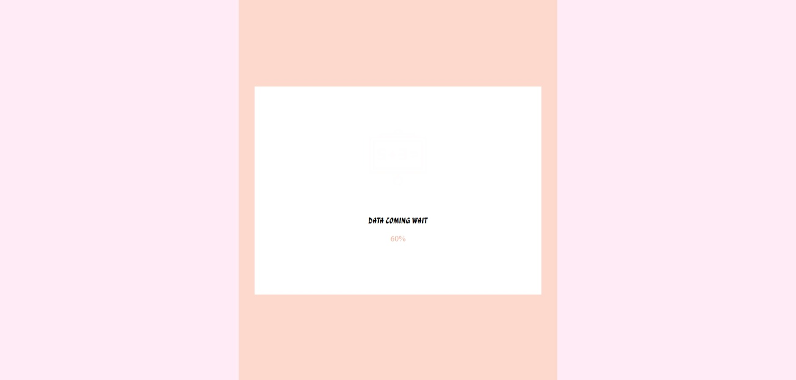
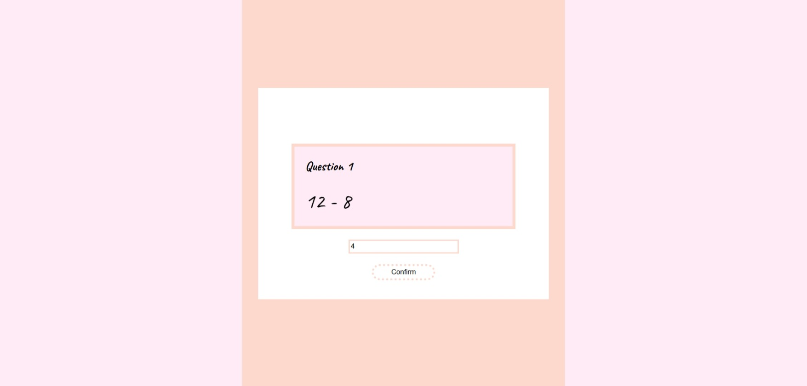
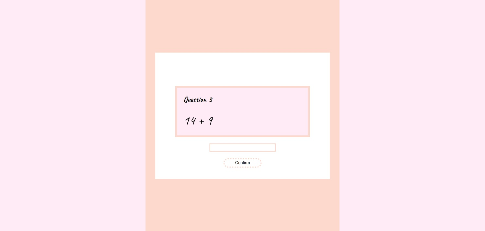

# 🧮 Maths Quiz Web Application

A simple and interactive **browser-based maths quiz** that allows users to answer questions and receive **instant feedback**.  
The application is designed to test basic maths skills while demonstrating core frontend web development concepts.

---

## 🚀 Live Demo

🔗 https://washuravele.github.io/MathQuiz

---

## 📌 Project Overview

The Maths Quiz Web Application presents users with maths questions, evaluates their answers in real time, and provides immediate feedback.  
It is built using ** HTML, CSS, and JavaScript**, focusing on logic, user interaction, and clean UI design.

---


## ✨ Features

- Simple and intuitive interface
- Personalized user experience (name input)
- Readiness confirmation before starting
- Real-time answer validation
- Responsive design for desktop and mobile

---


## 🖼 Screenshots

### Welcome Page 


### Loading App 



### First  Maths Question


### Third  Maths Question



---

## 🛠 Tech Stack

- **HTML** – Structure  
- **CSS** – Styling and layout  
- **JavaScript** – Quiz logic and interactivity  

---

## 🧪 How It Works

1. The user opens the quiz in the browser  
2. A maths question is displayed  
3. The user selects or enters an answer  
4. JavaScript checks the answer  
5. Instant feedback 

---


## 📁 Project Structure
├── Icons/      `Custom icons used in the UI`  
├── screenshots/      
├── sounds/     `Sound effects for feedback `        
├── index.html  `Main HTML structure `         
├── index.css   `Styling and layout`              
├── index.js    `Quiz logic and interactivity1`     


---


## 📦 Setup Instructions

1. Clone the repository:
   ```bash
   git clone https://github.com/vashuravale/maths-quiz.git

---
✨ Future Improvements
*	Add multiple questions with scoring
*  Include timer and progress tracking
*  Enhance accessibility and localization
---


## 👨‍💻 Author

**Washu Ravele**
Aspiring Software Developer

* GitHub: [https://github.com/washuravele](https://github.com/washuravele)

---

## 📄 License

This project is for educational and portfolio purposes.